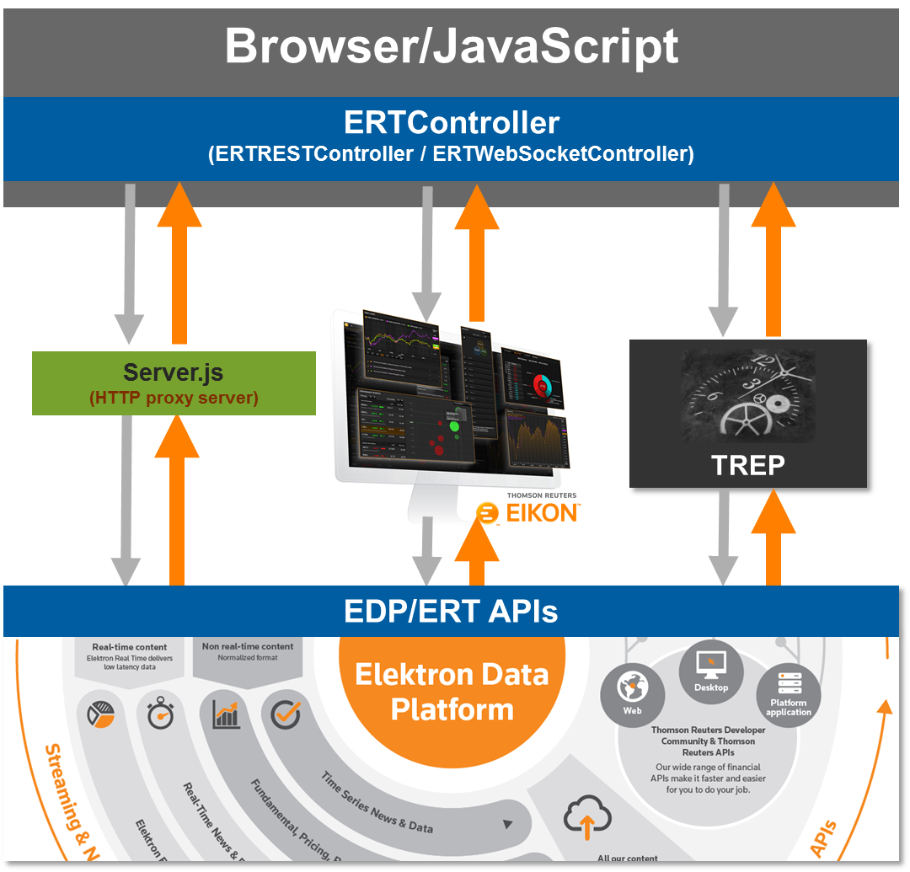

# ERT Controller

## Table of Content

* [Overview](#overview)
* [Disclaimer](#disclaimer)
* [Components](#components)
* [Package](#package)
* [Examples](#examples)

## <a id="overview"></a>Overview
The ERT (Elektron RealTime) controller, formally [TRWebSocketController](https://github.com/TR-API-Samples/Example.WebSocketAPI.Javascript.TRWebSocketController), is a series of JavaScript interfaces used to manage communication to the ERT streaming services available within either the Elektron Data Platform (EDP), a locally deployed TREP environment or through your Eikon Desktop installation.  Delivering real-time market data to the browser, the JavaScript interface is designed as a reusable component that can be used in a variety of simple web-based applications and prototypes.  

For any question related to this component, please use the Developer Community [Q&A Forum](https://community.developers.thomsonreuters.com).

***Note:** To be able to ask questions and to benefit from the full content available on the [Developer Community portal](https://developers.thomsonreuters.com) we recommend you to [register here]( https://developers.tr.com/iam/register) or [login here]( https://developers.thomsonreuters.com/iam/login?destination_path=Lw%3D%3D).*

## <a id="disclaimer"></a>Disclaimer
The source code presented in this project has been written by Refinitiv only for the purpose of illustrating the concepts of interfacing with ERT streaming services.  It has not been tested for a usage in production environments.

## <a id="components"></a>Components

The ERTController components provide the ability to connect to the streaming services via a TREP (ADS) local deployment, within your Eikon desktop installation (future) or directly to EDP/ERT in the cloud.



The components outlined below provide JavaScript applications to easily interface with the ERT streaming services in multiple ways.

- **server.js**

  When requesting for streaming services from EDP/ERT, applications must be authenticated using 
  the HTTP EDP authentication services prior to connecting into the ERT in the cloud over WebSockets. 
  To adhere to the "Same Origin" security policies, a simple server-side application (server.js) is provided which will act as an application proxy managing EDP authentication.

  The server side application is based on [Node.js](https://nodejs.org/en/)'s [Express.js](https://expressjs.com/) framework. This server application acts a web server and application/proxy server for managing all HTTP REST communication from a web browser to EDP HTTP REST services.

- **ERTRESTController.js**

  The ERTRESTController is a generic interface used to manage all HTTP communications in a web browser to EDP HTTP REST server via server.js.

- **ERTWebSocketController.js**

  The ERTWebSocketController is a generic interface used to manage all WebSocket communications to the ERT real-time services.

   

## <a id="package"></a>Package

Software components used:

* [Elektron WebSocket API](https://developers.thomsonreuters.com/elektron/websocket-api-early-access) - Interface to access Elektron real-time market data. 

* [Pako](https://www.npmjs.com/package/pako) (v1.0.6) - Nodejs-based library used to decompress Elektron Machine Readable News (MRN) headlines and stories.  Applications utilizing the news capabilities offered within this interface must include the 'zlib.js' script within their HTML.

    **Note**: The 'zlib.js' file was prepared by [browserfying](http://browserify.org/) the pako library.  This is a process to bring the capabilities of the node.js library to the browser.  For convenience and interest, I've included the node.js-based file called 'pako.js' which I used to create the 'zlib.js' package.  Refer to 'pako.js' file for general instructions as to how I did this.


## <a id="examples"></a>Examples

The package contains a number examples demonstrating different features available within the components.  Based how you plan to access the ERT streaming services, will require a unique setup and configuration.

### TREP/ADS

To execute all TREP-based examples requires the specific JavaScript source to be loaded within your browser.  Once loaded, the example will form a direct connection into your deployed TREP/ADS server.  Refer to the section of code within the example JavaScript source that requires the connection and authentication details:

```javascript
// Connect into the ERT streaming services via TREP...
ertController.connectADS("ewa", "15000", "user");
```


### EDP/ERT

Connecting into the cloud from your browser will require the JavaScript to run within a local proxy.  The browser enforces the [***Same-origin***](https://developer.mozilla.org/en-US/docs/Web/Security/Same-origin_policy) policy which is a critical security mechanism to reduce malicious attacks.  

To setup your environment to run the EDT/ERT examples, perform the following steps:

1. Within the installation directory, install [Node.js](https://nodejs.org/en/) modules by executing the following.  

   **Note**: Node.js must be installed on your machine.

   ```
   $> npm install
   ```

   This will create a local directory called node_modules/ containing the modules to run a local HTTP server.

2. Start your server

   ```
   $> node server.js
   ```

   This will start a local HTTP server running on port 8080.

   **Note**: If the machine is behind a proxy server, you need to configure Node.js to use a proxy instead of a direct HTTP connection via the following command in a command prompt:

   ```
   set https_proxy=http://<proxy.server>:<port>
   ```

3. Configure your access within your specific example.  Refer to the section of code that requires the authentication details:

   ```javascript
   // Authenticate with EDP...
   edpController.get_access_token({
           'username': '<username>',
           'password': '<password>',
           'clientId': '<AppKey>' 
   });  
   ```

4. Load your example within the browser using the following URL format:

   ```
   http://localhost:8080/<example>.html
   ```

   Example:

   ```
   http://localhost:8080/EDP_quoteExample.html
   ```


### Eikon (future)


## <a id="contributing"></a>Contributing

Please read [CONTRIBUTING.md](https://gist.github.com/PurpleBooth/b24679402957c63ec426) for details on our code of conduct, and the process for submitting pull requests to us.

## <a id="authors"></a>Authors

* **Nick Zincone** - Release 1.0.  *Initial version*

## <a id="license"></a>License

This project and the Pako library are licensed under the [MIT License](https://opensource.org/licenses/MIT) - see the [LICENSE.md](LICENSE.md) file for details.
